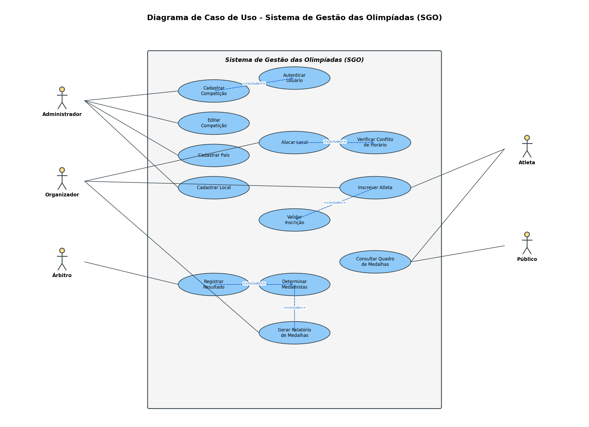
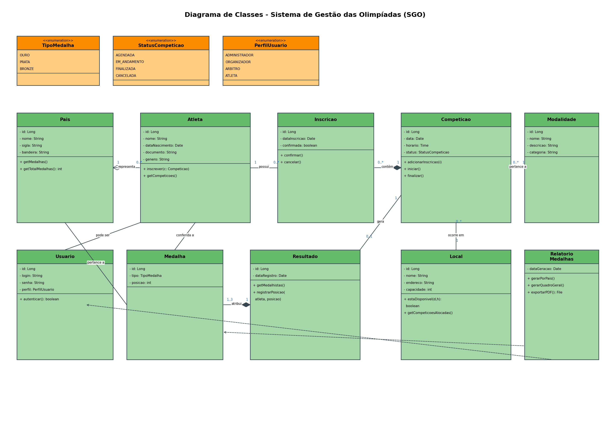
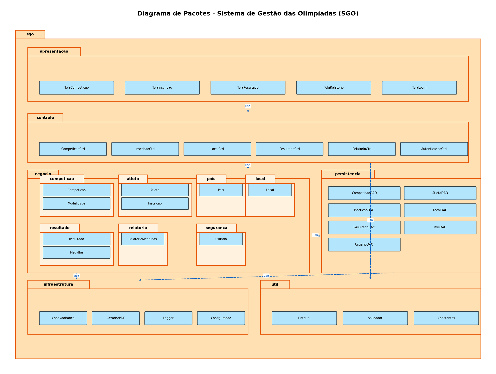
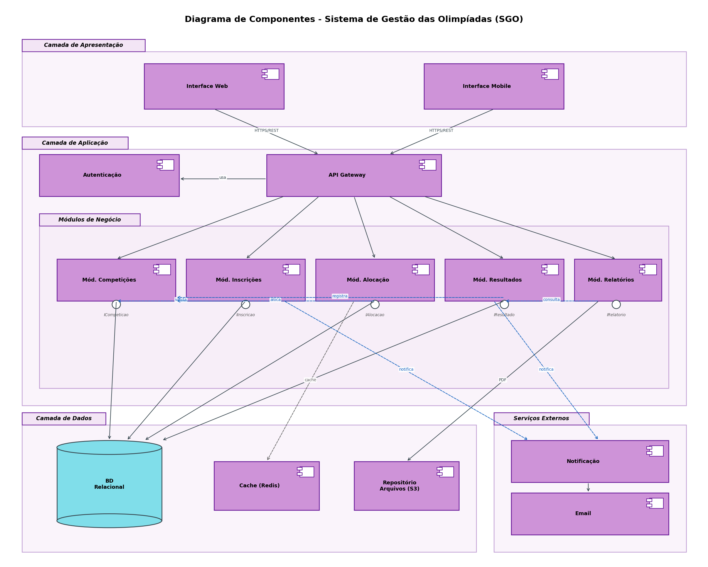
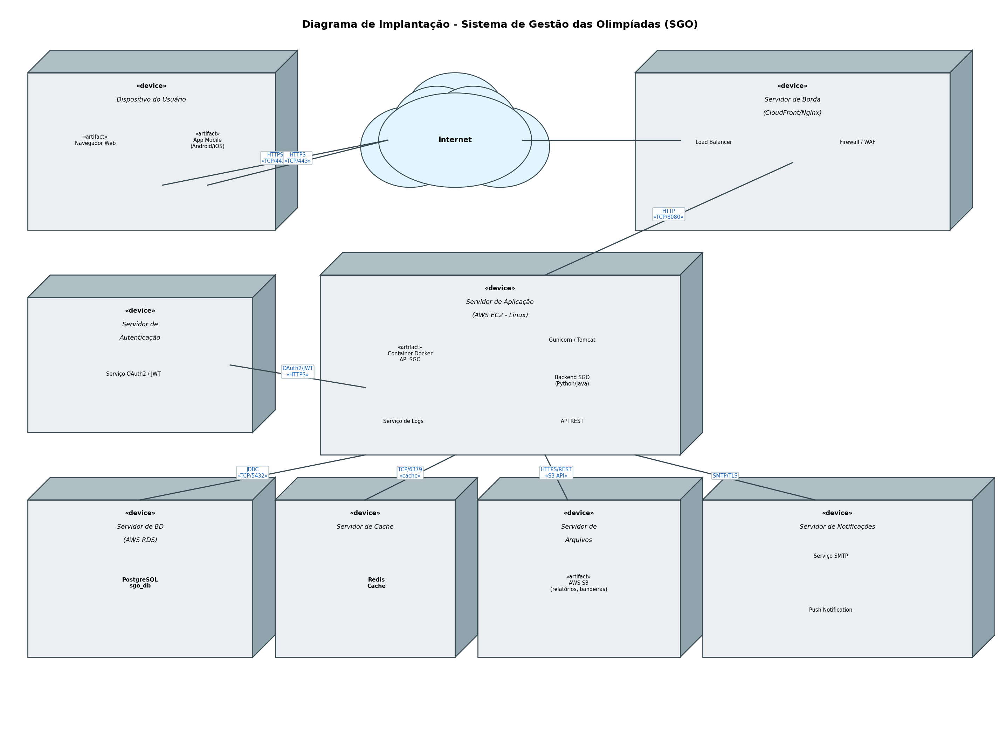

# Sistema de Gestão das Olimpíadas (SGO)

> **Trabalho 1 - Primeira Entrega - Projeto de Software**  
> **Curso:** Engenharia de Software — **PUC Minas**  
> **Disciplina:** Projeto de Software (4º período)  
> **Professor:** João Paulo Carneiro Aramuni
> **Professor:** Nicolas Araújo e Matheus Dias


---

## 📋 Sumário

- [Descrição do Sistema](#-descrição-do-sistema)
- [Regras de Negócio](#-regras-de-negócio)
- [Histórias de Usuário](#-histórias-de-usuário)
- [Diagramas UML](#-diagramas-uml)
  - [Diagrama de Caso de Uso](#1-diagrama-de-caso-de-uso)
  - [Diagrama de Classes](#2-diagrama-de-classes)
  - [Diagrama de Pacotes](#3-diagrama-de-pacotes)
  - [Diagrama de Componentes](#4-diagrama-de-componentes)
  - [Diagrama de Implantacao](#5-diagrama-de-implantacao)
- [Estrutura do Repositório](#-estrutura-do-repositório)
- [Tecnologias Utilizadas](#-tecnologias-utilizadas)

---

## 📖 Descrição do Sistema

Com a chegada das Olimpíadas, um novo sistema de gestão é necessário para coordenar os diferentes aspectos do evento. O **Sistema de Gestão das Olimpíadas (SGO)** deve permitir:

- O gerenciamento de competições;
- A inscrição de atletas;
- A alocação de locais para as provas;
- O controle de resultados;
- A geração de relatórios de medalhas por país.

---

## 📜 Regras de Negócio

1. **Cadastro de competições:** o sistema deve permitir o cadastro de competições, que incluem o nome da modalidade, data, horário, local e lista de atletas inscritos.
2. **Inscrição de atletas:** atletas de diferentes países devem se inscrever em competições específicas. Cada atleta pode participar de várias competições, mas só pode representar um país em cada modalidade.
3. **Alocação de locais:** os locais para as competições devem ser alocados de forma a evitar conflitos de horário. Um local só pode abrigar uma competição por vez.
4. **Controle de resultados:** após a realização das competições, os resultados devem ser registrados, determinando o atleta vencedor e os classificados em segundo e terceiro lugares.
5. **Relatórios de medalhas:** o sistema deve gerar relatórios de medalhas, mostrando o desempenho de cada país com base nas medalhas de ouro, prata e bronze conquistadas.

---

## 👥 Histórias de Usuário

### US01 — Cadastrar Competição
> **Como** administrador do SGO,  
> **quero** cadastrar uma nova competição informando modalidade, data, horário e local,  
> **para que** os atletas possam se inscrever e a competição seja realizada na infraestrutura adequada.

**Critérios de aceitação:**
- O sistema deve validar que a data e horário são futuros;
- O local informado deve estar disponível no horário escolhido;
- A competição deve ser vinculada a uma modalidade já cadastrada.

---

### US02 — Inscrever Atleta em Competição
> **Como** organizador (ou atleta autenticado),  
> **quero** inscrever um atleta em uma competição específica,  
> **para que** ele possa disputar a prova representando seu país.

**Critérios de aceitação:**
- O atleta deve estar vinculado a um país;
- O atleta não pode representar mais de um país na mesma modalidade;
- A inscrição deve ocorrer antes do prazo final estipulado para a competição;
- O sistema deve permitir que um mesmo atleta participe de várias competições diferentes.

---

### US03 — Alocar Local para Competição
> **Como** organizador do evento,  
> **quero** alocar um local para a realização de uma competição,  
> **para que** não haja conflito de horário entre competições no mesmo espaço físico.

**Critérios de aceitação:**
- O sistema deve verificar a disponibilidade do local na data e horário escolhidos;
- Um local só pode receber uma competição por vez;
- Caso haja conflito, o sistema deve recusar a alocação e exibir mensagem clara ao usuário.

---

### US04 — Registrar Resultado de Competição
> **Como** árbitro responsável pela competição,  
> **quero** registrar o resultado final, indicando os atletas em 1º, 2º e 3º lugares,  
> **para que** as medalhas sejam corretamente atribuídas aos países representados.

**Critérios de aceitação:**
- A competição deve estar com status “finalizada”;
- Os atletas indicados como medalhistas devem estar inscritos na competição;
- O sistema gera automaticamente as medalhas de ouro, prata e bronze.

---

### US05 — Consultar Quadro de Medalhas
> **Como** atleta ou membro do público,  
> **quero** consultar o quadro de medalhas atualizado,  
> **para que** eu acompanhe o desempenho dos países participantes.

**Critérios de aceitação:**
- O quadro deve exibir, por país, a quantidade de medalhas de ouro, prata e bronze;
- A ordenação padrão segue o critério olímpico (ouro > prata > bronze);
- O quadro deve estar acessível ao público sem necessidade de autenticação.

---

### US06 — Gerar Relatório de Medalhas
> **Como** organizador do evento,  
> **quero** gerar um relatório consolidado das medalhas obtidas por cada país,  
> **para que** eu possa publicar os resultados oficiais e exportá-los em PDF.

**Critérios de aceitação:**
- O relatório deve poder ser filtrado por modalidade e por data;
- Deve ser possível exportar o relatório em PDF;
- O relatório só pode ser gerado após o registro dos resultados das competições.

---

### US07 — Cadastrar País e Atleta
> **Como** administrador,  
> **quero** cadastrar países e atletas no sistema,  
> **para que** as inscrições e o controle de medalhas possam ser realizados corretamente.

**Critérios de aceitação:**
- Cada país deve ter nome, sigla e bandeira;
- Cada atleta deve estar vinculado a um país no momento de seu cadastro;
- Não é permitido cadastrar atletas duplicados (mesmo documento).

---

### US08 — Autenticar Usuário
> **Como** usuário do sistema (administrador, organizador, árbitro ou atleta),  
> **quero** autenticar-me no sistema com login e senha,  
> **para que** eu acesse apenas as funcionalidades correspondentes ao meu perfil.

**Critérios de aceitação:**
- O sistema deve usar autenticação segura (OAuth2/JWT);
- Funcionalidades restritas devem ser bloqueadas para usuários não autenticados;
- O perfil do usuário define os casos de uso disponíveis (controle de acesso por papel).

---

## 📊 Diagramas UML

Todos os diagramas a seguir foram modelados utilizando **PlantUML**. Os arquivos `.puml` correspondentes estão disponíveis na pasta [`codigos/`](./codigos).

### 1. Diagrama de Caso de Uso

Modela as principais interações entre os atores (Administrador, Organizador, Árbitro, Atleta e Público) e o sistema, contemplando os casos de uso essenciais: cadastro de competições, inscrição de atletas, alocação de locais, registro de resultados e geração de relatórios de medalhas.



📄 Código-fonte: [`codigos/diagrama-de-caso-de-uso.puml`](./codigos/diagrama-de-caso-de-uso.puml)

---

### 2. Diagrama de Classes

Representa a estrutura estática do sistema com as classes **Pais**, **Atleta**, **Inscricao**, **Competicao**, **Modalidade**, **Local**, **Resultado**, **Medalha**, **Usuario** e **RelatorioMedalhas**, além das enumerações (`TipoMedalha`, `StatusCompeticao`, `PerfilUsuario`) e dos relacionamentos com cardinalidades.



📄 Código-fonte: [`codigos/diagrama-de-classes.puml`](./codigos/diagrama-de-classes.puml)

---

### 3. Diagrama de Pacotes

Mostra a organização do sistema em camadas/pacotes seguindo o padrão de separação de responsabilidades: **apresentacao**, **controle**, **negocio** (com subpacotes por domínio), **persistencia**, **infraestrutura** e **util**.



📄 Código-fonte: [`codigos/diagrama-de-pacotes.puml`](./codigos/diagrama-de-pacotes.puml)

---

### 4. Diagrama de Componentes

Apresenta os componentes lógicos do sistema e suas interações: Interface de Usuário (Web/Mobile), API Gateway, Autenticação, Módulos de Negócio (Competições, Inscrições, Alocação, Resultados, Relatórios), camada de dados (BD relacional, cache, repositório de arquivos) e serviços externos (notificação e e-mail).



📄 Código-fonte: [`codigos/diagrama-de-componentes.puml`](./codigos/diagrama-de-componentes.puml)

---

### 5. Diagrama de Implantação

Ilustra a arquitetura física do sistema, mostrando como os componentes são distribuídos: dispositivos dos usuários (navegador e app mobile), servidor de borda (CloudFront/Nginx + WAF), servidor de aplicação (AWS EC2 com Docker), servidor de autenticação (OAuth2/JWT), servidor de banco de dados (AWS RDS - PostgreSQL), cache (Redis), repositório de arquivos (AWS S3) e servidor de notificações (SMTP/Push).



📄 Código-fonte: [`codigos/diagrama-de-implantação.puml`](./codigos/diagrama-de-implantacao.puml)

---

## 📁 Estrutura do Repositório

```
sistema-gestao-olimpiadas/
├── README.md
├── imagens/
│   ├── diagrama-de-caso-de-uso.png
│   ├── diagrama-de-classes.png
│   ├── diagrama-de-pacotes.png
│   ├── diagrama-de-componentes.png
│   └── diagrama-de-implantação.png
└── codigos/
    ├── diagrama-de-caso-de-uso.puml
    ├── diagrama-de-classes.puml
    ├── diagrama-de-pacotes.puml
    ├── diagrama-de-componentes.puml
    └── diagrama-de-implantação.puml
```

---

## 🛠️ Tecnologias Utilizadas

- **PlantUML** — modelagem dos diagramas UML  
  - 🔗 https://plantuml.com/  
  - 🔗 https://plantuml.com/guide
- **PlantUML API** (para geração das imagens)  
  - 🔗 https://github.com/joaopauloaramuni/projeto-de-software/tree/main/PROJETOS/Python/Projeto%20PlantUML%20API
- **Markdown** — documentação no GitHub

---

## ✍️ Como regenerar as imagens a partir dos arquivos .puml

Com o PlantUML instalado localmente:

```bash
# Gera todas as imagens da pasta codigos/ em formato PNG
plantuml -tpng codigos/*.puml -o ../imagens/
```

Ou utilize o servidor PlantUML on-line: <https://www.plantuml.com/plantuml/uml/>.

---

## 📝 Observação

Este trabalho corresponde apenas à **modelagem/diagramação** do sistema. O desenvolvimento do código-fonte da aplicação não faz parte do escopo desta entrega.

